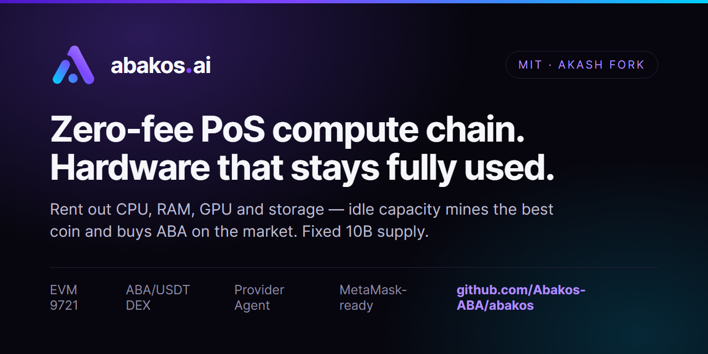

# Abakos (ABA) — Zero-Fee, EVM-Compatible Proof-of-Stake Compute Blockchain

[](https://abakos.ai)
[-2ea44f)](docs/fee-model.md)
[](https://evm-rpc.abakos.ai)
[](#tokenomics-fixed-supply--deflationary)
[](#tokenomics-fixed-supply--deflationary)
[](https://abakos.ai)



**Abakos is a zero-fee, EVM-compatible Proof-of-Stake blockchain for decentralized compute (DePIN).** It is a fork of the open [Akash](https://akash.network) stack (Cosmos SDK + CometBFT) with a native EVM, an on-chain DEX, and a **Provider Agent** that keeps every machine fully utilized: rent CPU, RAM, GPU and storage through the Console, and when GPU or CPU would otherwise sit idle, the agent mines the most profitable coin and auto-converts the proceeds into **ABA**.

> **Project name** from the Greek *ábax / abakos* (abacus, the oldest computing device) — a direct tie to compute. **Ticker `ABA`.** Live at **[abakos.ai](https://abakos.ai)**.
>
> **Tagline:** *Hardware that stays fully used.*

---

## Why Abakos

- **⚡ Free transactions (0 gas).** The L1 is intentionally **zero-fee** for both Cosmos and EVM transactions — `eth_gasPrice = 0`. No gas, no base fee, no minimum gas price. Users and dApps transact for nothing; spam is bounded by consensus and mempool limits instead of price. See [the fee model](docs/fee-model.md).
- **🔥 Deflationary tokenomics.** **Fixed 10,000,000,000 ABA supply, 0% inflation, never minted.** A protocol burn on mining, Chat and API revenue permanently removes ABA from circulation, making supply **deflationary** over time.
- **🖥️ Maximum income from every machine.** The **Provider Agent** rents hardware first, then idle-mines free GPU/CPU into ABA — no empty hours, and no ABA printed as a fake subsidy.
- **🔗 EVM + Cosmos, one chain.** Native `cosmos/evm` (EIP-155 **chain id 9721**), MetaMask-ready Ethereum JSON-RPC, plus full Cosmos SDK modules (staking, gov, marketplace).
- **💧 On-chain ABA/USDT DEX.** A Uniswap-v2 fork with the standard 0.30% swap fee going entirely to liquidity providers.
- **🌐 Live public sandbox.** Wallet, explorer, faucet, DEX, and Provider Dashboard are running today.

## What Abakos is

Abakos runs the product suite Akash proved — Console for deploys, Chat, an OpenAI-compatible API, and provider software — on its **own** Proof-of-Stake chain forked from [`akash-network/node`](https://github.com/akash-network/node) (Cosmos SDK + CometBFT, Apache-2.0). **ABA** is the settlement and staking asset with native fee capture, a fixed genesis allocation, and validator economics.

The differentiator versus plain GPU-rental networks is the **Provider Agent**, which keeps every machine fully utilized. Paid rentals fill the machine first; any idle GPU or CPU mines the most profitable coin, auto-converts to ABA (buyback), and pays the host. Chain security is funded by protocol revenue and staking — **not** by inflating the token.

## How Abakos compares

Honest positioning against the networks people actually weigh it against:

| | **Abakos** | **Akash Network** | **Render / io.net** |
|---|---|---|---|
| Idle hardware | **Mines the best coin → proceeds buy ABA on the DEX** | Sits idle between leases | Sits idle between jobs |
| Transaction fees | **Zero** (Cosmos *and* EVM txs, `eth_gasPrice = 0`) | Gas in AKT | Gas on Solana / L2 |
| Token supply | **Fixed 10B, 0% inflation, protocol burn** | Inflationary (staking emissions) | Emission programs |
| Staking rewards | **Paid from real usage revenue** (12% mining cut, 3% rental fee) | Paid from inflation | n/a |
| EVM support | **Native, chain id 9721, MetaMask-ready** | No EVM | n/a |
| Stack | Fork of the proven Akash stack (Cosmos SDK + CometBFT) | Origin of the stack | Custom |

If you are searching for an **Akash alternative with an EVM**, a **zero-gas chain for dApps**, or a way to **earn on an idle GPU without new token emissions** — that is exactly the niche Abakos targets.

## Free transactions (zero gas)

Two independent mechanisms — do not conflate them. **Gas is zero; the protocol earns a small revenue share on real economic activity.**

Abakos is a **feeless / gasless L1** by design:

- `feemarket` params: `no_base_fee = true`, `base_fee = 0`, `min_gas_price = 0`
- Validator config: `minimum-gas-prices = "0uaba"` → `eth_gasPrice = 0`
- **Spam control is non-economic:** bounded by consensus `block.max_gas = 100,000,000` and a capped mempool (`max_txs_bytes = 128 MB`).
- Validators are compensated through the **compute economy** (Console rentals + idle-mining → ABA buyback), never through gas fees.

## Tokenomics: fixed supply + deflationary

| Property | Value |
|---|---|
| Ticker | **ABA** |
| Base denom | `uaba` (6 decimals, display `ABA`) |
| bech32 prefix | `abakos` |
| Genesis supply | **10,000,000,000 ABA (fixed)** |
| Inflation | **0% — never minted** |
| EVM chain id | **9721** (EIP-155) |
| Transaction fees | **0 (free / gasless)** |
| Supply pressure | **Deflationary** via protocol burn |

**Protocol revenue share** (the "cut" on earnings — separate from gas, which is zero). The network keeps a share of compute/mining/service revenue; the rest goes to the provider/service. The burn slice is sent to an unspendable address, permanently reducing supply.

| Revenue source | Protocol take | Split — staker / treasury / **burn** | Provider/service keeps |
|---|---|---|---|
| Idle-mining buyback | 12% | 4% / 4% / **4%** | **88%** (host) |
| Chat | 12% | 4% / 4% / **4%** | **88%** |
| API usage | 12% | 4% / 4% / **4%** | **88%** |
| Console / Marketplace | 3% | 1% / 1% / **1%** | **97%** |

> The **ABA/USDT DEX** (Uniswap-v2 fork) charges the standard **0.30% swap fee, 100% to liquidity providers** — no protocol split on swaps. Stablecoin standard is **USDT (BEP20)** for pool payouts and DEX pairing. Full spec: [`docs/fee-model.md`](docs/fee-model.md).

## Product pillars

| Pillar | What | For whom |
|---|---|---|
| `abakosd` (chain) | Akash fork, PoS, ABA settlement + staking + marketplace + **EVM** modules | Validators, everyone |
| Console | Deploy templates + bundles + add-ons, ABA escrow (`console.abakos.ai`) | Compute buyers |
| Provider Agent | Rent-first scheduler + idle GPU/CPU mining into ABA + Dashboard | GPU/CPU providers |
| Abakos Chat | Open-model chat, demand engine (`chat.abakos.ai`) | End users |
| Developer API | OpenAI-compatible gateway (`api.abakos.ai`) | Devs, AI startups |
| ABA/USDT DEX | On-chain Uniswap-v2 AMM (`abakos.ai/dex/`) | Traders, LPs |

## Core design decisions

1. **Utilization first, zero inflation.** Hosts are paid from real paths only: buyer ABA for rentals, or mining proceeds auto-converted to ABA. Security is paid from protocol revenue plus the staker share — ABA has **zero inflation** (fixed 10B supply) and is never minted.
2. **Free to transact.** Gas is zero on both the Cosmos and EVM sides so usage — payments, swaps, contract calls — costs nothing.
3. **Deflationary by design.** A burn slice on every revenue source permanently removes ABA from supply.
4. **Bundles, not naked GPUs.** A deployment is always CPU + RAM + disk, with optional GPU, persistent storage and IP lease add-ons (the Akash lease model).
5. **ABA wallet at MVP.** Settlement is ABA-wallet-only at the start; a fiat→ABA onramp comes later.

## Networks

- **`abakos-sandbox-1` — LIVE.** Mainnet-grade public sandbox: own genesis, validator, gov/staking, marketplace **and EVM** modules, public endpoints, zero-fee transactions. ABA has no market value here by design.
- **`abakos-1` — future mainnet.** Same architecture with new genesis keys, after audit and external validator onboarding.

**Live endpoints:** [`abakos.ai`](https://abakos.ai) · `rpc.` / `rest.abakos.ai` (Cosmos) · `evm-rpc.abakos.ai` (Ethereum JSON-RPC, MetaMask) · web wallet · explorer · faucet · [`abakos.ai/dex/`](https://abakos.ai/dex/) · Provider Dashboard.

## Repository layout

```
abakos/
  chain/          # abakosd: PoS chain, fork of akash-network/node (Cosmos SDK), ABA + EVM
  chain-sdk/      # vendored + rebranded Akash SDK (abakos/uaba prefixes)
  dex/            # Uniswap-v2 fork: Factory, Router, WABA, ABA/USDT pair, deploy scripts
  provider-agent/ # Provider Agent: profitability oracle + payout engine + backend
  pool-proxy/     # Stratum proxy: per-address share attribution for pool mining (Kryptex)
  site/           # marketing site + wallet + explorer + Provider Dashboard (abakos.ai)
  docs/           # litepaper + whitepaper + fee-model (canonical)
  desktop/        # cross-platform desktop app (Tauri): wallet + miner + live stats (WIP)
  marketplace/    # notes (the marketplace lives in the chain modules)
  api/            # notes (OpenAI-compatible gateway, planned)
  legacy/         # ARCHIVED, not the product: btcd PoUW prototype + early research
```

## Status

**Live:** [abakos.ai](https://abakos.ai) (site, waitlist) + `console.` / `chat.` / `status.` subdomains. The public sandbox **`abakos-sandbox-1`** is live: `abakosd` PoS chain (10B ABA, 0% inflation, ~1s blocks, **zero-fee**), Cosmos `rpc.`/`rest.`, a native **EVM** (`cosmos/evm`, EIP-155 chain id **9721**) with Ethereum JSON-RPC at `evm-rpc.abakos.ai` and MetaMask support, a web wallet, explorer, faucet, an on-chain **ABA/USDT DEX**, and the **Provider Agent** (real CPU/GPU mining → ABA payouts with the 88 / 4 / 4 / 4 split).

- [`docs/litepaper.md`](docs/litepaper.md), [`docs/whitepaper.md`](docs/whitepaper.md), and [`docs/fee-model.md`](docs/fee-model.md) are the canonical public docs.
- **Sandbox handoff (what is live vs what is blocked):** [`docs/18-sandbox-status-and-next-steps.md`](docs/18-sandbox-status-and-next-steps.md). Start there before Console / MetaMask / provider work.
- Earlier PoUW/Pearl-era planning notes are archived under [`legacy/`](legacy/) and are **not** the product.

**Next:** see the sandbox status doc (Console wallet Connected bug is the current P0). Then buyback / burn, EVM + AMM audit, fiat onramp, mainnet.

## FAQ

**Is Abakos a fork of Akash Network?**
Yes — the chain forks [`akash-network/node`](https://github.com/akash-network/node) (Apache-2.0, Cosmos SDK + CometBFT) and keeps the proven marketplace modules, then adds a native EVM, zero-fee transactions, an on-chain ABA/USDT DEX and the Provider Agent. Attributions are preserved (see [NOTICE](NOTICE)).

**How do I earn with an idle GPU or CPU?**
Run the Provider Agent. It rents your CPU, RAM, GPU and storage out through the Console when there is demand; when a GPU or CPU would sit idle it mines the most profitable coin and the proceeds **buy ABA on the open market** — 88% to you, 4% stakers, 4% treasury, 4% burned. No empty hours.

**Is ABA inflationary?**
No. All 10,000,000,000 ABA exist at genesis; none are ever minted. Stakers and validators are paid from real usage revenue (the 12% mining cut and the 3% rental fee), and a third of every protocol cut is burned — supply only goes down.

**How can transactions be free? What stops spam?**
The L1 sets `eth_gasPrice = 0` for both Cosmos and EVM transactions. Spam is bounded by consensus and mempool limits instead of price — see the [fee model](docs/fee-model.md).

**Can I use MetaMask?**
Yes. Native Ethereum JSON-RPC at `evm-rpc.abakos.ai`, EIP-155 chain id **9721**.

**Is this live today?**
The public sandbox is live: chain + EVM, web wallet, explorer, faucet, ABA/USDT DEX, Provider Agent + Dashboard. Console, Chat and the API are in development; mainnet follows after an audit and external validator onboarding. Canonical status: [abakos.ai/status](https://abakos.ai/status/).

## Build (chain)

The chain is a Cosmos SDK app and builds on **Linux** (Go 1.25+, CosmWasm `libwasmvm`). Use WSL or a Linux server; Windows is for editing only. Build/run steps live in [`chain/`](chain/).

## Deployment (site, live)

- **Host:** IONOS VPS, Ubuntu, Caddy (auto-TLS).
- **Site content:** built from `site/` (`npm run build`) and deployed via the `MarlonMoralesServer` ops repo.

## Community

- ⭐ **Star this repo** — it is the single strongest signal that makes Abakos discoverable for the next person searching for a zero-fee compute chain.
- 🌐 Website & waitlist: [abakos.ai](https://abakos.ai)
- 💬 Questions and ideas: [GitHub Discussions](https://github.com/Abakos-ABA/abakos/discussions)
- 🐦 Updates: [@Abakos_ai on X](https://x.com/Abakos_ai)

---

*Living planning document. Parameters (numbers, allocation, splits) are starting values, subject to legal and audit review before any mainnet.*
