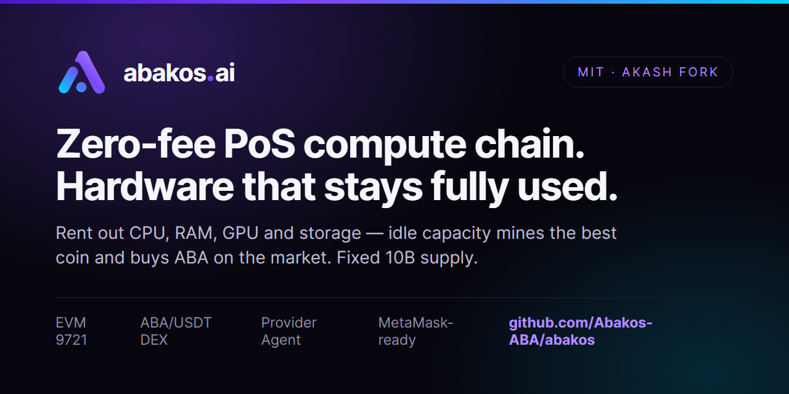

# Abakos (ABA) — Earn With Your Idle PC on a Zero-Fee, EVM-Compatible Proof-of-Stake Compute Chain

[](https://github.com/Abakos-ABA/abakos/releases/latest)
[](https://github.com/Abakos-ABA/abakos/releases)
[](https://status.abakos.ai)
[-2ea44f)](docs/fee-model.md)
[](https://evm-rpc.abakos.ai)
[](LICENSE)
[](https://github.com/Abakos-ABA/abakos/stargazers)



**Abakos turns idle hardware into income.** The desktop app mines the **most profitable coin** on your idle **CPU (Monero/RandomX)** and **GPU** — profit-switching like NiceHash — converts the proceeds into **real Circle USDC** and **buys ABA on the on-chain DEX**, paid straight to your wallet by verified shares. Underneath runs a **zero-fee, EVM-compatible Proof-of-Stake blockchain** for decentralized compute (**DePIN**), forked from the proven [Akash](https://akash.network) stack (Cosmos SDK + CometBFT).

> **Name** from the Greek *ábax / abakos* (abacus, the oldest computing device). **Ticker `ABA`.** Live at **[abakos.ai](https://abakos.ai)**. *Hardware that stays fully used.*

---

## ⬇️ Get started in 2 minutes

| | |
|---|---|
| 🖥️ **Desktop app** (Windows · Linux) | **[Download the latest release →](https://github.com/Abakos-ABA/abakos/releases/latest)** — wallet + one-click miner + live stats, signed builds with auto-update |
| 🐍 **One command** (any machine with Python 3) | `curl -sL https://abakos.ai/miner.py \| python3 - <your-abakos-address>` |
| 🌐 **No hardware?** | [Trade on the DEX](https://abakos.ai/dex/) · [Web wallet](https://abakos.ai/wallet/) · [Explorer](https://abakos.ai/explorer/) |

If Abakos is useful or interesting to you, **[⭐ star this repo](https://github.com/Abakos-ABA/abakos/stargazers)** — stars are how the next person searching for *"earn crypto with an idle PC"* finds it.

## How the payout pipeline works (all of it is live)


```mermaid
flowchart LR
  A["Idle CPU / GPU"] -->|"mines the most profitable coin"| B["unMineable pool"]
  B -->|"pool payout"| C["ATOM / POL"]
  C -->|"Skip API: swap + CCTP"| D["USDC on Noble (Circle)"]
  D -->|"IBC"| E["USDC on Abakos"]
  E -->|"on-chain buyback (DEX)"| F["ABA"]
  F -->|"88% you · 4% stakers · 4% treasury · 4% burn"| G["Your wallet"]
```

Every hop is real and inspectable on-chain: real mining shares, real Circle USDC over IBC (Noble), a real Uniswap-v2 buyback, and on-chain payouts split **88 / 4 / 4 / 4**.

## Why Abakos

- **⚡ Free transactions (0 gas).** The L1 is intentionally **zero-fee** for Cosmos *and* EVM transactions — `eth_gasPrice = 0`. No gas, no base fee. See [the fee model](docs/fee-model.md).
- **🖥️ Maximum income from every machine.** The **Provider Agent** rents hardware out first; idle GPU/CPU profit-switch-mines into ABA — no empty hours, and no ABA printed as a fake subsidy.
- **💵 Real stablecoin rails.** One canonical **USDC** (Circle-issued on Noble, over IBC). Deposit USDC from **Polygon, Ethereum, Arbitrum, Base & more without leaving the page** — the DEX bridges in-app via Skip/CCTP/IBC.
- **🔥 Deflationary tokenomics.** **Fixed 10,000,000,000 ABA, 0% inflation, never minted.** Every protocol revenue stream burns a slice permanently.
- **🔗 EVM + Cosmos, one chain.** Native `cosmos/evm` (EIP-155 **chain id 9721**), MetaMask/Keplr-ready Ethereum JSON-RPC, plus full Cosmos SDK modules (staking, gov, marketplace).
- **💧 On-chain ABA/USDC DEX.** Uniswap-v2 fork: **0.30% swap fee — 0.25% to LPs, 0.05% protocol** (⅓ stakers · ⅓ treasury · ⅓ burn). LP token: **ABA-LP**.
- **🌐 Live public sandbox.** Wallet, explorer, DEX with in-app bridge, and the Provider Dashboard are running today — with real value flowing.

## How Abakos compares

Honest positioning against the networks people actually weigh it against:

| | **Abakos** | **Akash Network** | **Render / io.net** |
|---|---|---|---|
| Idle hardware | **Mines the best coin → proceeds buy ABA on the DEX** | Sits idle between leases | Sits idle between jobs |
| Transaction fees | **Zero** (Cosmos *and* EVM txs, `eth_gasPrice = 0`) | Gas in AKT | Gas on Solana / L2 |
| Token supply | **Fixed 10B, 0% inflation, protocol burn** | Inflationary (staking emissions) | Emission programs |
| Staking rewards | **Paid from real usage revenue** (12% mining cut, 3% rental fee, DEX fee) | Paid from inflation | n/a |
| EVM support | **Native, chain id 9721, MetaMask-ready** | No EVM | n/a |
| Stablecoin | **Canonical Circle USDC (Noble, IBC) + in-app bridge** | IBC USDC | Various |
| Stack | Fork of the proven Akash stack (Cosmos SDK + CometBFT) | Origin of the stack | Custom |

If you are searching for an **Akash alternative with an EVM**, a **zero-gas chain for dApps**, a **profit-switching miner app**, or a way to **earn on an idle GPU without new token emissions** — that is exactly the niche Abakos targets.

## Tokenomics: fixed supply + deflationary

| Property | Value |
|---|---|
| Ticker | **ABA** |
| Base denom | `uaba` (6 decimals, display `ABA`) |
| bech32 prefix | `abakos` |
| Genesis supply | **10,000,000,000 ABA (fixed)** |
| Inflation | **0% — never minted** |
| EVM chain id | **9721** (EIP-155) |
| Transaction fees | **0 (free / gasless)** |
| Supply pressure | **Deflationary** via protocol burn |

**Protocol revenue share** (separate from gas, which is zero). A share of real economic activity funds stakers, the treasury and a permanent burn:

| Revenue source | Protocol take | Split — staker / treasury / **burn** | Provider/service keeps |
|---|---|---|---|
| Idle-mining buyback | 12% | 4% / 4% / **4%** | **88%** (host) |
| Console / Marketplace | 3% | 1% / 1% / **1%** | **97%** |
| DEX swaps | 0.05% of volume | ⅓ / ⅓ / **⅓** | LPs keep **0.25%** |
| Chat / API (planned) | 12% | 4% / 4% / **4%** | **88%** |

Full spec: [`docs/fee-model.md`](docs/fee-model.md) · [`docs/litepaper.md`](docs/litepaper.md) · [`docs/whitepaper.md`](docs/whitepaper.md).

## Products

| Pillar | What | Status |
|---|---|---|
| **Abakos Provider** (desktop) | Wallet + one-click idle miner (CPU RandomX, GPU) + live stats, auto-update | **[Released](https://github.com/Abakos-ABA/abakos/releases/latest)** |
| `abakosd` (chain) | Akash fork: PoS, ABA settlement + staking + marketplace + **EVM** | **Sandbox live** |
| ABA/USDC DEX | On-chain Uniswap-v2 AMM + in-app USDC bridge from Polygon & more | **[Live](https://abakos.ai/dex/)** |
| Provider Agent + Dashboard | Rent-first scheduler, profit-switch mining, on-chain payouts | **[Live](https://abakos.ai/dashboard/)** |
| Console | Deploy templates + bundles + add-ons, ABA escrow | In development |
| Abakos Chat / Developer API | Open-model chat + OpenAI-compatible gateway | Planned |

## Live endpoints

[`abakos.ai`](https://abakos.ai) · `rpc.` / `rest.abakos.ai` (Cosmos) · `evm-rpc.abakos.ai` (Ethereum JSON-RPC — MetaMask/Keplr, chain id 9721) · [web wallet](https://abakos.ai/wallet/) · [explorer](https://abakos.ai/explorer/) · [DEX](https://abakos.ai/dex/) · [mining pool](https://pool.abakos.ai/) · [Provider Dashboard](https://abakos.ai/dashboard/) · [status](https://status.abakos.ai/)

## Repository layout

```
abakos/
  chain/          # abakosd: PoS chain, fork of akash-network/node (Cosmos SDK), ABA + EVM
  chain-sdk/      # vendored + rebranded Akash SDK (abakos/uaba prefixes)
  dex/            # Uniswap-v2 fork: Factory, Router, WABA, ABA/USDC pair (ABA-LP), deploy scripts
  provider-agent/ # Provider Agent: profitability oracle + payout engine + DEX-fee split
  pool-proxy/     # Stratum proxy: per-address share attribution (unMineable multi-pool)
  bridge-relayer/ # Mining payout forwarder (Skip/CCTP/IBC) + Noble forwarding accounts
  desktop/        # Abakos Provider desktop app (Tauri): wallet + miner + live stats
  site/           # built site mirror (source of truth: abakos.ai repo)
  docs/           # litepaper + whitepaper + fee-model (canonical)
  legacy/         # ARCHIVED research, not the product
```

## FAQ

**How do I earn with an idle GPU or CPU?**
Install the [desktop app](https://github.com/Abakos-ABA/abakos/releases/latest) (or run the one-line miner). It mines the most profitable coin on idle hardware; the mined value converts to real USDC and **buys ABA on the open market** — 88% to you, 4% stakers, 4% treasury, 4% burned. Payouts are on-chain, by verified shares, no account, no minimum.

**Is the payout real or simulated?**
Real, end to end: unMineable pool payouts → swapped to Circle USDC (Skip/CCTP) → Noble → IBC to Abakos → on-chain DEX buyback → ABA in your wallet. Every step is publicly visible in the [explorer](https://abakos.ai/explorer/).

**How do I deposit USDC from Polygon (or another chain)?**
Directly inside the [DEX page](https://abakos.ai/dex/) — pick the coin + chain, the route (Skip API → CCTP → Noble → IBC) runs in the background and it arrives as the same canonical USDC. No manual bridging.

**Is Abakos a fork of Akash Network?**
Yes — the chain forks [`akash-network/node`](https://github.com/akash-network/node) (Apache-2.0) and keeps the proven marketplace modules, then adds a native EVM, zero-fee transactions, the USDC rails, the on-chain DEX and the Provider Agent. Attributions preserved (see [NOTICE](NOTICE)).

**Is ABA inflationary?**
No. All 10,000,000,000 ABA exist at genesis; none are ever minted. Stakers are paid from real usage revenue, and a slice of every protocol cut is burned — supply only goes down.

**How can transactions be free? What stops spam?**
`eth_gasPrice = 0` for both Cosmos and EVM transactions. Spam is bounded by consensus and mempool limits instead of price — see the [fee model](docs/fee-model.md).

**Can I use MetaMask or Keplr?**
Both. Native Ethereum JSON-RPC at `evm-rpc.abakos.ai`, EIP-155 chain id **9721**; the DEX supports any EVM wallet via EIP-6963, Keplr/Leap/Cosmostation work on the Cosmos side.

**Is this mainnet?**
Not yet. The public **sandbox** is live with real value rails but no guarantees. Mainnet follows after a security audit and external validator onboarding — canonical status: [status.abakos.ai](https://status.abakos.ai/).

## Build (chain)

The chain is a Cosmos SDK app and builds on **Linux** (Go 1.25+, CosmWasm `libwasmvm`). Use WSL or a Linux server; see [`chain/`](chain/).

## Security

The sandbox intentionally runs **real value rails** as a proving ground. Found something? See [SECURITY.md](SECURITY.md) — meaningful findings are rewarded.

## Community

- ⭐ **[Star this repo](https://github.com/Abakos-ABA/abakos/stargazers)** — the single strongest signal that makes Abakos discoverable.
- 🌐 Website: [abakos.ai](https://abakos.ai)
- 💬 Discord: [discord.gg/zBxNvdMjtM](https://discord.gg/zBxNvdMjtM) · [GitHub Discussions](https://github.com/Abakos-ABA/abakos/discussions)
- 🐦 Updates: [@Abakos_ai on X](https://x.com/Abakos_ai)

---

*Living project. Parameters (numbers, allocations, splits) are sandbox values, subject to legal and audit review before any mainnet. ABA on the sandbox carries no guarantees.*
